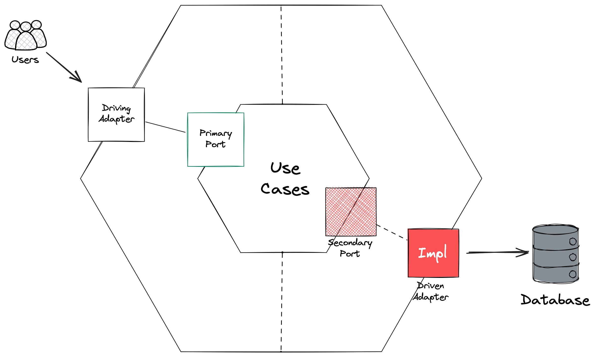

# Structuring Your Rust Application

In this module, you'll learn how to structure larger Rust applications using modules and the Ports and Adapters architecture pattern (also known as Hexagonal Architecture). For you as a .NET developer, this is comparable to organizing your solution with Clean Architecture principles, separating core business logic from infrastructure concerns.

## Learning Objectives

By the end of this module, you will:
- Understand the Ports and Adapters (Hexagonal) architecture pattern
- Learn how to use Rust's module system to organize your code
- Implement a clean separation between business logic and data access
- Apply access control modifiers to enforce architectural boundaries

## Understanding Ports and Adapters Architecture

Ports and Adapters, or Hexagonal Architecture, is a software architecture pattern that emphasizes the separation of concerns by dividing your application into layers:

:::info

The fundamental idea around structuring your code in this way is to seperate business logic from infrastructure concerns. That's it.

:::

### Core Domain/Use Cases 

Contains your business logic and domain entities with no external dependencies. This is the purest expression of your business logic, and the problem you are trying to solve. This code should be portable, and able to run anywhere.

Think your `User` enum, your `UserDetails` struct and the actual business logic code to register and retrieve a user.

### Ports

Define interfaces that the core uses to communicate with the outside world, or ports that the outside world uses to call business logic. For example `CreateRecipeCommandHandler` or `UserRepository`. In .NET, your ports would typically be implemented as interfaces, which are then implemented by.

### Adapters

Implement the interfaces defined by ports, connecting external systems to your core. Adapters can either be **driving adapters** or **driven adapters**. A driving adapter calls into the business logic, for example your web framework or a background thread reading messages from a queue. A driven adapter makes calls out to external dependencies for example databases, messaging middlewares etc

This pattern allows you to isolate your core business logic from external dependencies, making it more testable and maintainable.

